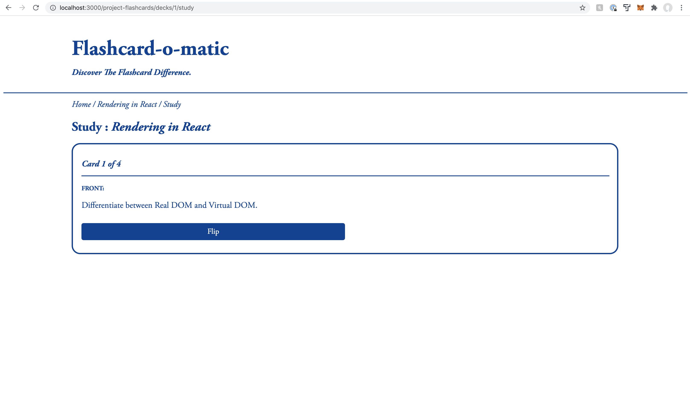

# Flashcard-o-matic

## Summary

Flashcard-o-matic is a web app that allows users to create, edit, and study decks of flashcards using React function components. This project created as my frontend capstone project for Thinkful's Software Engineering program. I designed a sleek and stripped-down user interface using vanilla CSS, and I organized routes and nested routes using React Router.

## Tech Stack

JavaScript, React, React Hooks, React Router, HTML, CSS

## Client

#### Home

#### Create Deck

#### View Deck

#### Edit Deck

#### Study Deck

#### Add Card

#### Edit Card

